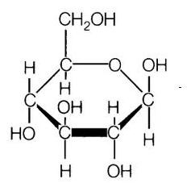
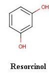

### Theory:

Carbohydrates are polyhydroxy aldehydes and ketones or substances that hydrolyze to yield polyhydroxy aldehydes and ketones.  Aldehydes (–CHO) and ketones ( = CO) constitute the major groups in carbohydrates.

 &nbsp;

Carbohydrates are mainly divided into monosaccharides,  disaccharides and polysaccharides. The commonly occurring monosaccharides includes glucose, fructose, galactose, ribose, etc. The two monosaccharides combine together to form disaccharides which include sucrose, lactose and maltose.  Starch and cellulose fall into the category of polysaccharides, which consist of many monosaccharide residues.

 
 &nbsp;
 

 

#### Molisch’s Test:

 

This is a common test for all carbohydrates larger than tetroses. The  test is on the basis  that pentoses and hexoses are dehydrated by conc. Sulphuric acid  to form furfural or hydroxymethylfurfural, respectively.  These products condense with α-naphthol to form  purple condensation product.

 &nbsp;

 

                   

a: Furfural   
b: α-Naphthol

 &nbsp;
 
 #### Fehling’s Test:

 

This forms the reduction test of carbohydrates.  Fehling’s solution contains blue alkaline cupric hydroxide solution, heated with reducing sugars gets reduced to yellow or red cuprous oxide and is precipitated. Hence, formation of the yellow or brownish-red colored precipitate helps in the detection of reducing sugars in the test solution.

 
 &nbsp;
 

#### Benedict’s Test:

 

 As in Fehling’s test, free aldehyde or keto group in the reducing sugars reduce cupric hydroxide in alkaline medium to red colored cuprous oxide. Depending on the concentration of sugars, yellow to green color is developed . All monosaccharides are reducing sugars as  they all have a free reactive carbonyl group.  Some disaccharides, like maltose, have exposed carbonyl groups and are also reducing sugars,  but less reactive than monosaccharides

 

 

 
 &nbsp;

#### Barfoed’s Test:

 

 Barfoed's test is used to detect the presence of monosaccharide (reducing) sugars in solution. Barfoed's reagent, a mixture of ethanoic (acetic) acid and copper(II) acetate, is combined with the test solution and boiled. A red copper(II) oxide precipitate is formed will indicates the presence of reducing sugar. The reaction will be negative in the presence of disaccharide sugars because they are weaker reducing agents. This test is specific for monosaccharides . Due to the weakly acidic nature of Barfoed's reagent, it is reduced only by monosaccharides.

 

 
 &nbsp;

#### Seliwanoff’s Test:

 

It is a color reaction specific for ketoses. When conce: HCl is added. ketoses undergo dehydration to yield furfural derivatives more rapidly than aldoses.  These derivatives form complexes with resorcinol to yield deep red color. The test reagent causes the dehydration of ketohexoses to form 5-hydroxymethylfurfural. 5-hydroxymethylfurfural reacts with resorcinol present in the test reagent to produce a red product within two minutes (reaction not shown). Aldohexoses reacts so more slowly to form the same product.

 

                                          

  &nbsp;

#### Bial’s Test:

 

 Bial’s test is used to distinguish between pentoses and hexoses. They react with Bial’s reagent and are converted to furfural. Orcinol and furfural condense in the presence of ferric ion to form a colored product. Appearance of green colour or precipitate indicates the presence of pentoses and formation of muddy brown precipitate shows the presence of hexoses.

 
 &nbsp;

#### Iodine Test:

 

This test is used for the detection of starch in the solution. The blue-black colour is due to the formation of starch-iodine complex. Starch contain polymer of α-amylose and amylopectin which forms a complex with iodine to give the blue black colour.

 

 
 &nbsp;

 #### Osazone Test:

 

The ketoses and aldoses react with phenylhydrazine to produce a phenylhydrazone which further reacts with another two molecules of phenylhydrazine to yield osazone. Needle-shaped yellow osazone crystals are produced by glucose, fructose and mannose, whereas lactosazone produces mushroom shaped crystals. Crystals of different shapes will be shown by different osazones. Flower-shaped crystals are produced by maltose.
